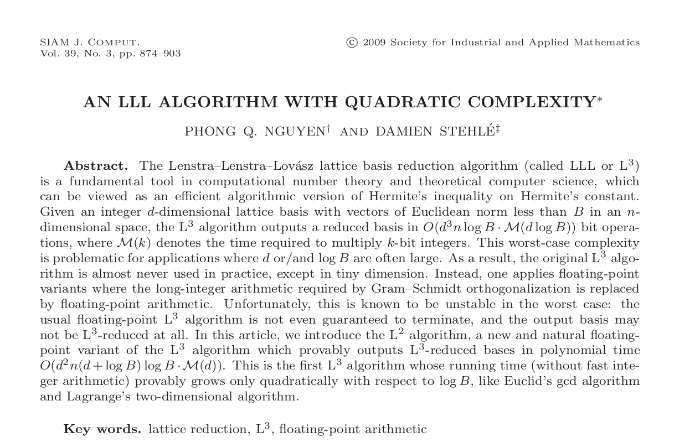

# L2 Reduction: LLL Algorithm With Quadratic Complexity
Coding the 2009 paper that introduced the L2 floating-point reduction algorithm: _An LLL Algorithm With Quadratic Complexity_ (Nguyen & Stehle, 2009). Complete writeup available on [LeetArxiv](https://leetarxiv.substack.com/p/l2-reduction-fast-lll-quadratic-complexity).



## Getting Started

The repo is written to be followed alongside this [LeetArxiv article](https://leetarxiv.substack.com/p/l2-reduction-fast-lll-quadratic-complexity).

Clone the repo and run using:
```
jupyter notebook
```

You might also enjoy:
1. [Gauss-Lagrange 2D Lattice Reduction](https://leetarxiv.substack.com/p/2-dimensional-lattice-basis-reduction).
2. [Gauss Lattice Sieving](https://leetarxiv.substack.com/p/gauss-lll-sieve)

